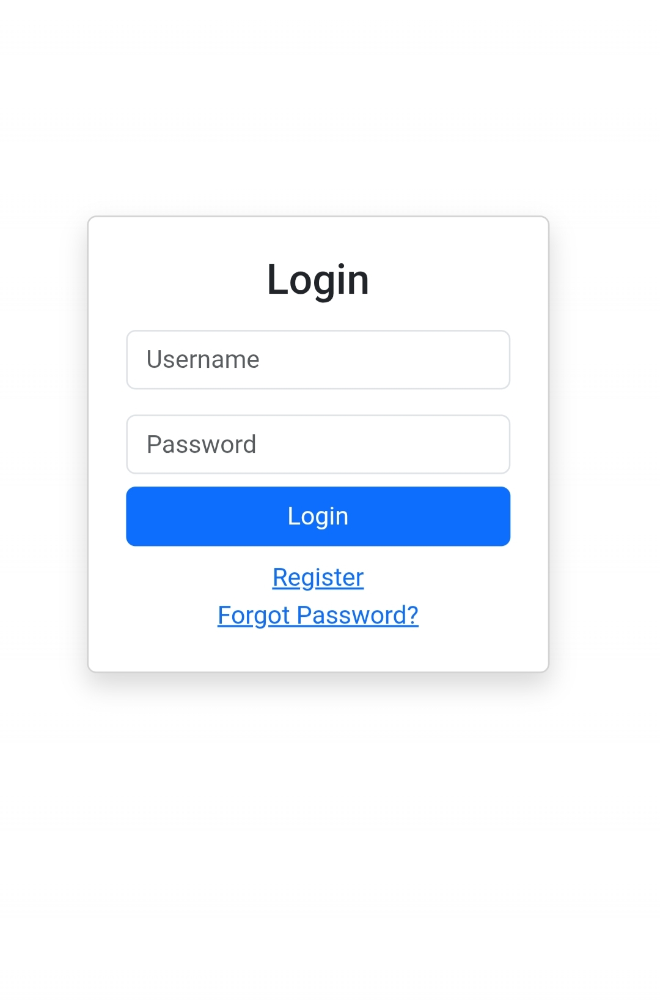
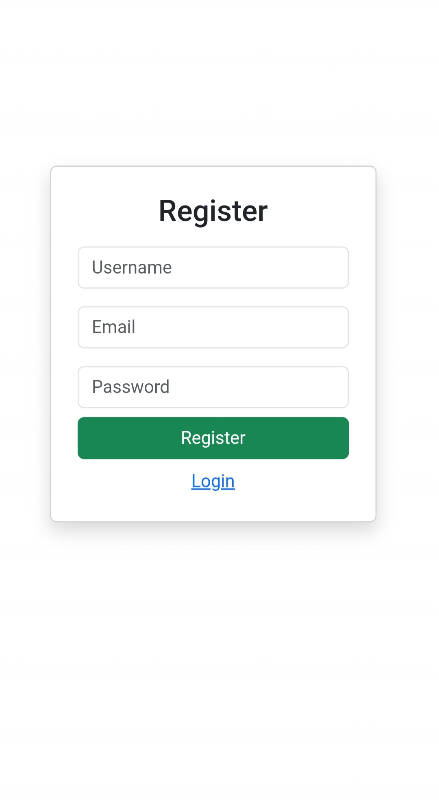
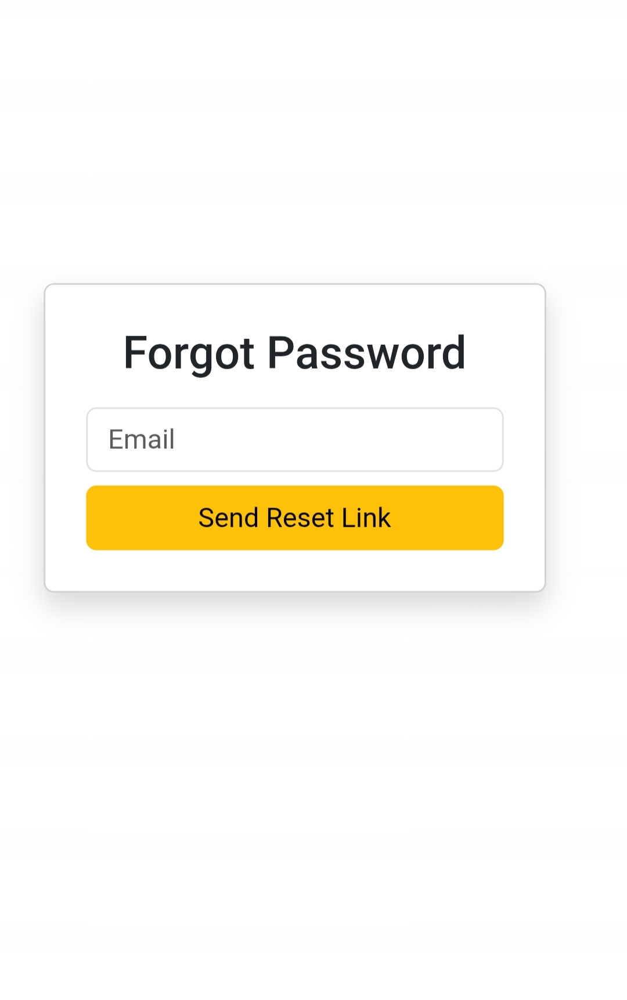
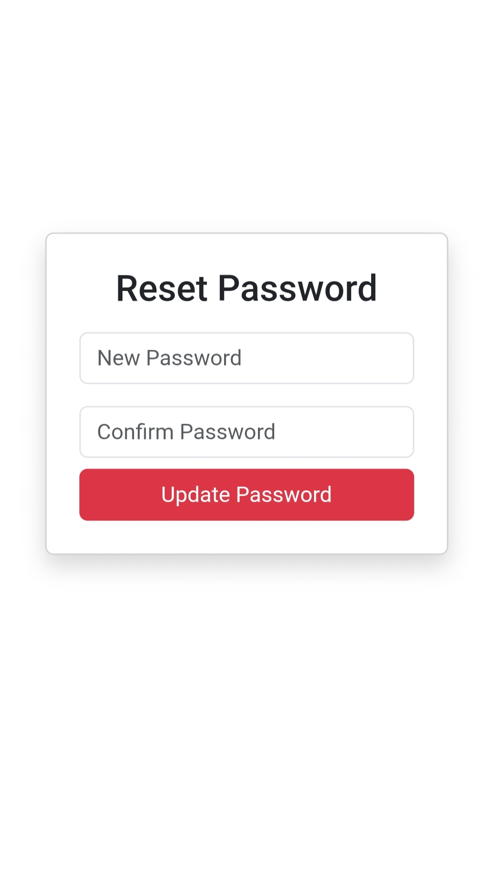
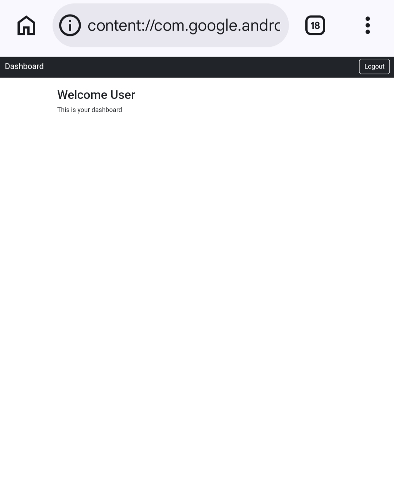

# Authentication System (Bootstrap 5)

## Project Overview
This project is a simple Authentication System UI built using HTML, CSS, and Bootstrap 5. It includes Login, Registration, Forgot Password, Reset Password, and Dashboard pages.

## Features
- Responsive design (mobile, tablet, desktop)
- Bootstrap 5 styling
- Clean and user-friendly interface
- Multiple authentication pages
- Navigation between pages

## Project Structure
authentication-system/
│
├── index.html              (Login Page)
├── register.html           (Registration Page)
├── forgot-password.html    (Forgot Password Page)
├── reset-password.html     (Reset Password Page)
├── dashboard.html          (Dashboard Page)
├── styles.css              (Custom Styling)
└── README.md               (Project Documentation)

## Technologies Used
- HTML5
- CSS3
- Bootstrap 5

## screenshots

### Login Page

### Register Page

### Forgot

### Reset

## Dashboard

## Author
Ganesh BS

## Status
Project Completed Successfully
